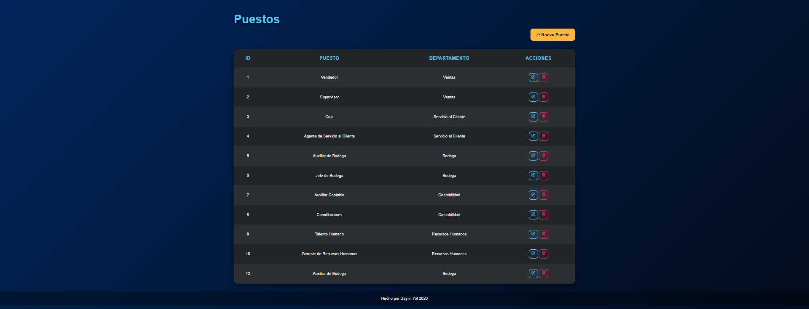
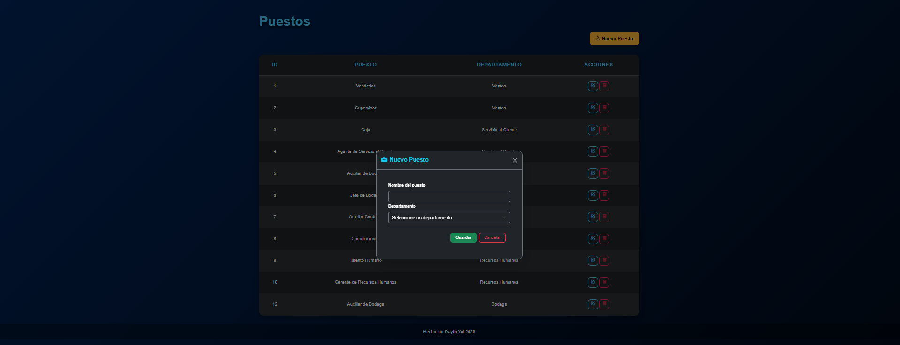
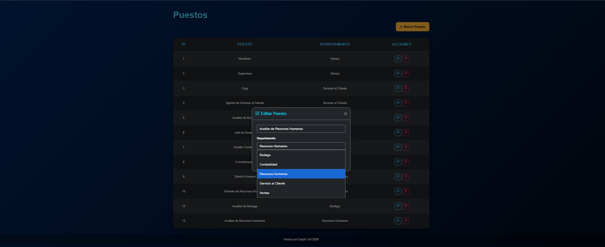
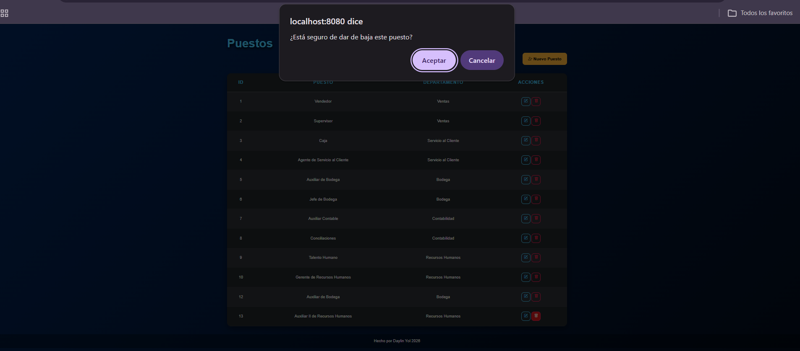

        # Evaluación de Desarrollo  - GS1 Guatemala
## Autor: Daylin Yessenia Yol Pastor | Fecha: Julio 2026

### Descripción del Proyecto-

 Este repositorio contiene la resolución completa de evaluación técnica para Desarrollador Web Junior de GS1 Guatemala. Incluye el diseño de un modelo de base de datos normalizado para un sistema de administración de empleados, consultas SQL de análisis de datos y un mantenimiento CRUD funcional sobre una de las entidades del modelo.

### Tecnologías Utilizadas-

- **Backend:** PHP 8.2.12 sin framework.
- **Base de Datos:** Microsoft SQL Server
- **Driver de Conexión:** Microsoft Drivers for PHP for SQL Server(sqlsrv/pdo_sqlsrv).
- **Frontend:** HTML, Bootstrap 5.3.7, Bootstrap Icons.
- **Herramientas:** XAMPP v3.3.0, SQL Server Management Studio (SSMS), Visual Studio Code, draw.io para diagrama ER.

### Requisitos-

1. XAMPP o cualquier servidor con Apache + PHP 8.2.
2. PHP 8.2 con las extensiones sqlsrv y pdo_sqlsrv habilitadas.
3. Microsoft SQL Server con SQL Server Authentication habilitada.
4. SQL Server Management Studio para ejecutar los scripts manualmente.

### Instalación-
Paso 1: Clonar repositorio dentro de la carpeta htdocs de la instalación de XAMPP:
    ````bash
     git clone https://github.com/DaylinYP/Evaluacion-de-Desarrollo-GS1.git 
    ```
    Copiar el proyecto a:
    C:\xampp\htdocs\SistemaEmpleados

Paso 2: Instalar los drivers SQL Server para PHP si no los tenemos en la computadora:
- Descargar desde la página oficial de Microsoft.
- Elegir la versión que coincida con la versión de PHP (en este proyecto PHP 8.2, Thread Safe x64)
- Copiar los archivos .dll a la carpeta ext/ de la instalación PHP.
- Habilitarlos en el archivo php.ini agregando:
            extension=php_pdo_sqlsrv_82_ts_x64
            extension=php_sqlsrv_82_ts_x64
- Reiniciar Apache.

### Configuración-
Este proyecto utiliza dos bases de datos, cada una con un propósito distinto:

| Base de datos | Propósito | Scripts |
|---------------|-----------|----------|
| **AdminEmpleados** | Modelo completo normalizado (3FN) con jerarquía organizacional, historiales y auditoría. | `database/schema.sql`<br>`database/seed.sql` |
| **SistemaEmpleados** | Esquema simplificado que respalda el mantenimiento CRUD. | `database/schema_mantenimiento.sql`<br>`database/seed_mantenimiento.sql` |


Para levantar el entorno completo:
1. Abrir SSMS y conectarse a la instancia local de SQL Server.
2. Ejecutar database/schema.sql completo y luego database/seed.sql
3. Ejecutar database/schema_mantenimiento.sql completo y luego database/seed_mantenimiento.sql
4. Crear el login de SQL Server Authentication con permisos sobre SistemaEmpleados (rol db_owner) si es que no estaba creado.
5. Configurar las credenciales en config/database.php

    ```php
    $connectionOptions = [
        "Database" => "SistemaEmpleados",
        "Uid" => "usuario",
        "PWD" => "contraseña"
    ];
    ```

### Ejecución-
Con XAMPP corriendo acceder a http://localhost/SistemaEmpleados/public/index.php

Desde esa parte podemos ver el listado de puestos, crear uno nuevo, editar o dar de baja a algun puesto existente.

### Decisiones de diseño-
1. Dos bases de datos separadas: Se implementó un esquema operativo simplificado "SistemaEmpleados" para la Sección 5 y 6, derivado de las entidades núcleo del modelo normalizado de la sección 3, priorizando el alcance funcional del CRUD solicitado.
2. Sin carpeta src/ centralizada: el proyecto sigue una convención común en proyectos PHP sin framework con controllers/, models/, views/, config/ y public/ en la raíz, en vez de anidarlos bajo una carpeta src/.
3. Sin carpeta routes: al utilizar PHP puro, el enrutamiento es implícito, cada archivo en public/ corresponde directamente a un endpoint accesible.
4. Baja lógica: En ambas bases de datos ningún registro se elimina físicamente. Las tablas principales usan una columna "estado" para marcar bajas, preservando el historial completo.
5. Modal de carga de página: Los formularios de alta y de edición se muestran en modales de Bootstrap, pero al enviarse recargan la página completa sin AJAX, priorizando una implementación simple y confiable dentro del tiempo disponible de la prueba.

### Evidencia de funcionamiento:

### Listado de Puestos


### Alta de Puesto / Crear Puesto


### Edicion de Puesto / Editar Puesto


### Baja de Puesto / Eliminar Puesto (no fisicamente)
